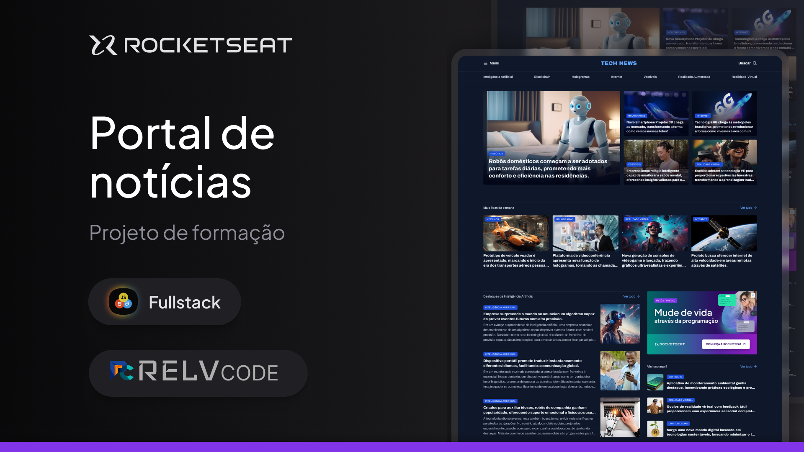
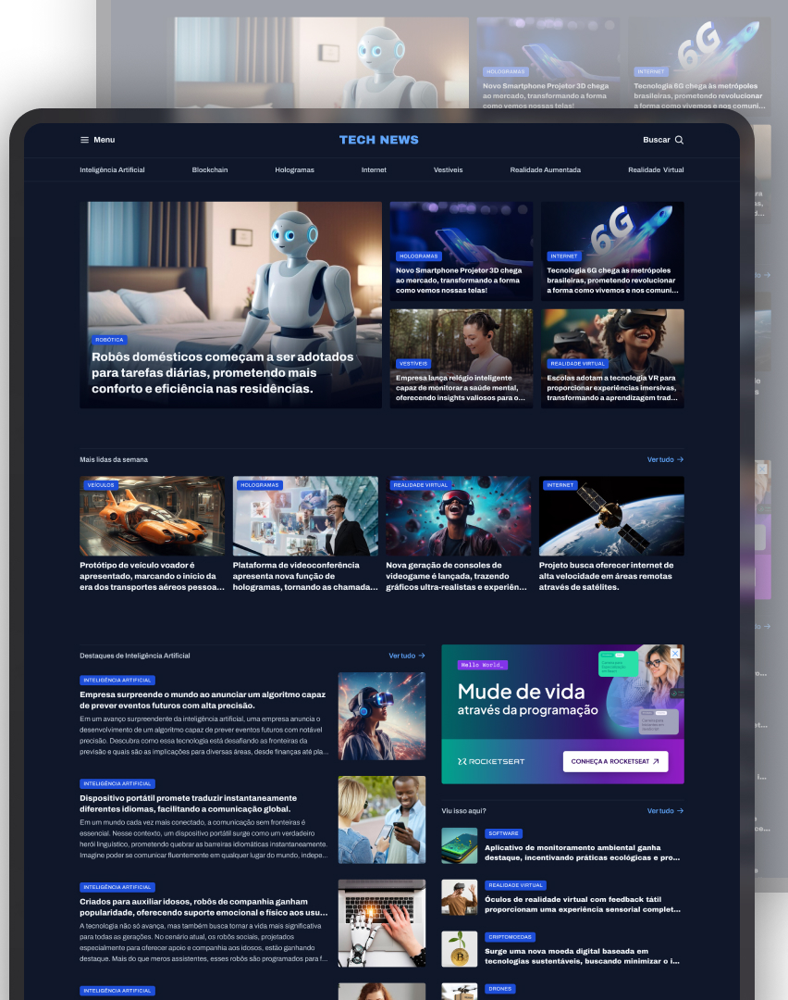
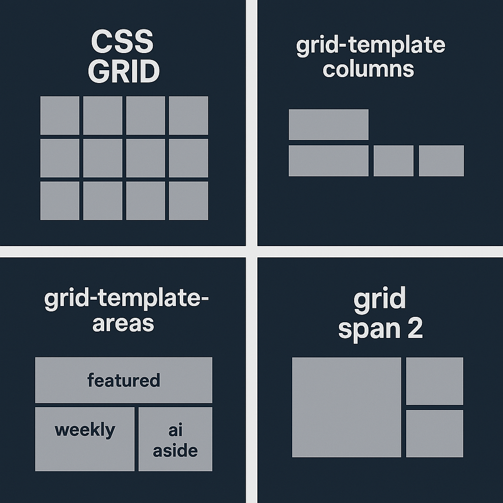
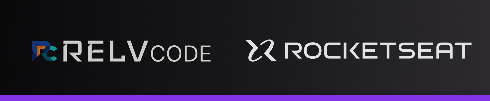

# 📰 Portal de Notícias

Este projeto foi desenvolvido durante o curso **[Avançando no HTML e CSS](https://app.rocketseat.com.br/classroom/avancando-no-html-e-css-2/group/projeto-portal-de-noticias/lesson/iniciando-o-projeto-6)** da [Rocketseat](https://rocketseat.com.br), com o objetivo de aplicar conceitos avançados de HTML e CSS, especialmente o uso do **CSS Grid Layout**.

<a href="https://emersonromana.github.io/tech-news/">Link para a página TECH NEWS</a>  (OBS: Ainda não está totalmente responsivo)

## 🧠 Conteúdo do Projeto

- HTML semântico
- CSS com variáveis, tipografia, responsividade
- Layout responsivo usando CSS Grid
- Organização por componentes
- Visual Studio Code com extensões recomendadas

## 🔧 Extensões recomendadas (VSCode)

Listadas no `extension.json`:

- `esbenp.prettier-vscode`
- `PKief.material-icon-theme`
- `rocketseat.theme-omni`
- `ritwickdey.LiveServer`

## 🖼️ Estrutura Visual

Abaixo, uma visualização do portal:



## 🧱 Como o CSS Grid foi utilizado

O layout do projeto é altamente baseado em **CSS Grid**, organizando áreas como:

- Destaque principal (`#featured`)
- Seção “Mais lidas da semana” (`#weekly`)
- Seção de inteligência artificial (`#ai`)
- Sidebar com conteúdo adicional (`aside`)

A estrutura base da `<main>` utiliza a seguinte definição:

```css
main {
  display: grid;
  grid-template-columns: 2fr 1.5fr;
  grid-template-areas: 
    "featured featured"
    "weekly weekly"
    "ai aside";
}
```

Cada seção então ocupa sua respectiva "área" de grid.

## 🗺️ Representação visual do Grid

Abaixo está um esquema simplificado da estrutura do CSS Grid usada no `main`:



- **Linha 1**: `featured` ocupa toda a largura (duas colunas)
- **Linha 2**: `weekly` também ocupa toda a largura
- **Linha 3**: `ai` à esquerda e `aside` à direita

---

## 📁 Estrutura de arquivos

```
📂 styles/
├── global.css
├── utility.css
├── index.css
├── header.css
├── sections.css
📄 index.html
📄 README.md
```

## 📸 Screenshots

Coloque imagens capturadas da tela do projeto na pasta `assets/screenshots/` para melhor visualização no GitHub.

---

## 🚀 Como rodar

1. Clone o repositório:
```bash
git clone https://github.com/seu-usuario/portal-noticias.git
```

2. Abra o arquivo `index.html` com o Live Server ou diretamente no navegador.

---

Feito com 💜 por Rocketseat e adaptado com anotações visuais para melhor compreensão do CSS Grid.

